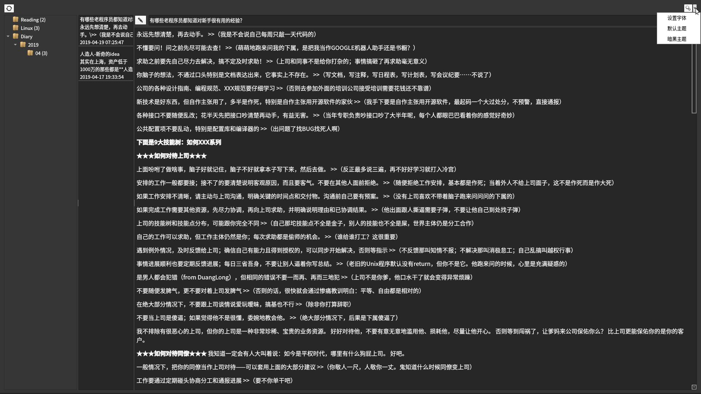
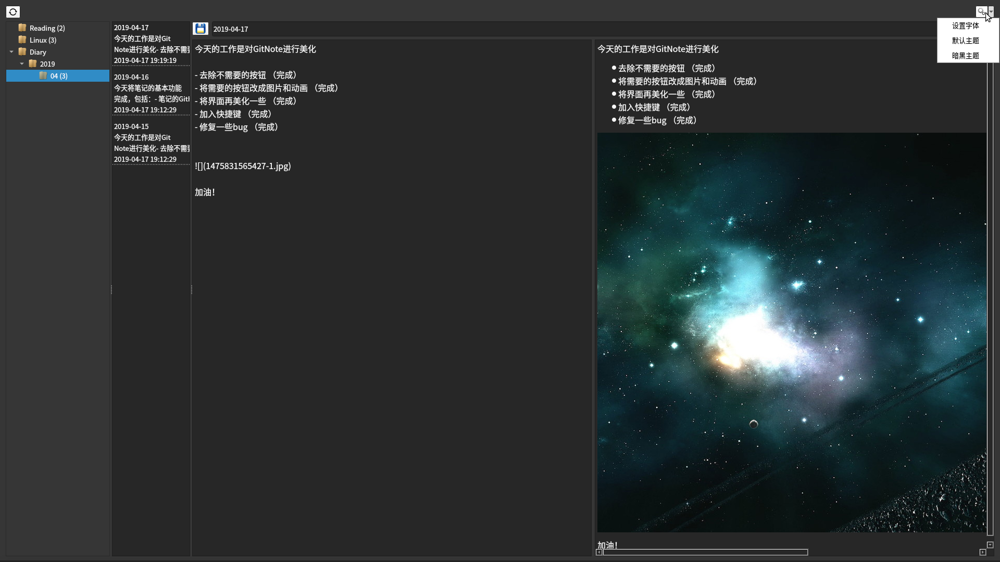

# GitNote
---------------------------------------
使用Git作为存储仓库的MarkDown云笔记。

安装必要环境，安装并配置Git

如果需要生成pdf，需要安装wkhtmltopdf

```
sudo apt install wkhtmltopdf
或者
yum install wkhtmltopdf
Windows下直接下载安装文件安装（https://wkhtmltopdf.org/downloads.html）
```

```
sudo apt install python3-pip
pip3 install pyqt5 gitpython mistune pdfkit
```

### 现在已完成基本功能，包括
	- 克隆
	- 更新，包括自动pull和push
	- markdown查看和编辑
	- 另存为pdf文件

### 其他功能开发中...

以下是一些现有功能截图



