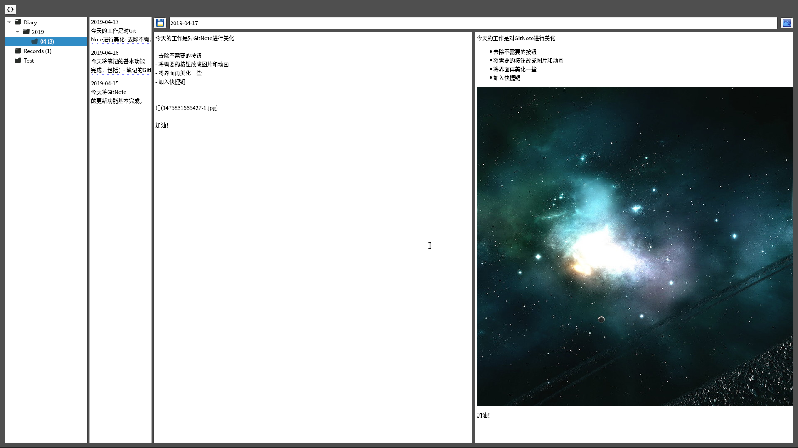
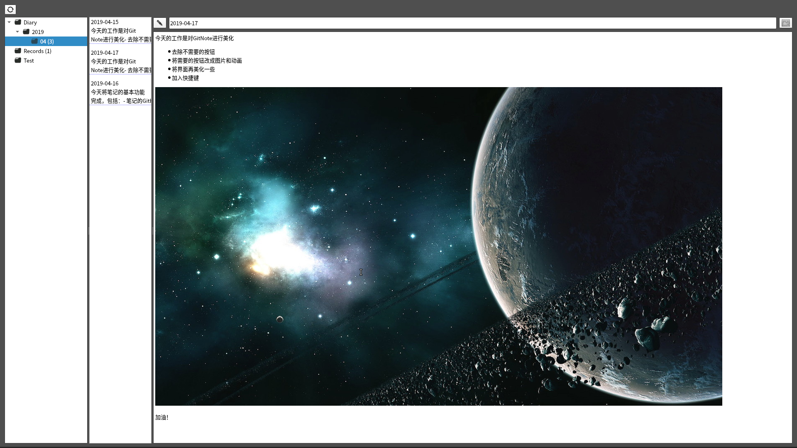

# GitNote
---------------------------------------
使用Git作为存储仓库的MarkDown云笔记。

安装必要环境，安装并配置Git
```
sudo apt install python3-pip
pip3 install pyqt5 gitpython mistune
```

### 现在已完成基本功能，包括
	- 克隆
	- 更新，包括自动pull和push
	- markdown查看和编辑

### 其他功能开发中...

以下是一些现有功能截图



